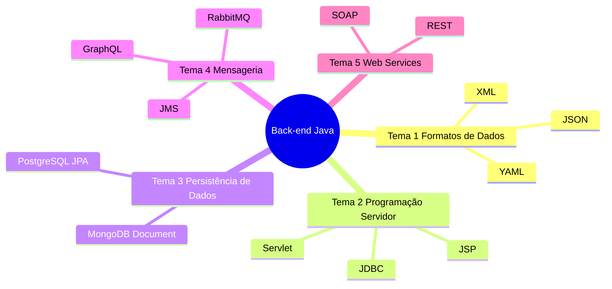

# estudos-java
Exercícios do semestre de back-end

## Mapa mental

## Temas

- [Tema 1. Formatos de transmissão de dados](tema-01-formatos-dados/FormatosDados.java)
- [Tema 2. Servlet, JSP e JDBC](tema-02-servlet-jsp-jdbc/README.md)
- [Tema 3. Persistência com Spring Data](tema-03-spring-data-postgresql-mongodb/README.md)
- [Tema 4. Serviços de mensageria](tema-04-servicos-mensageria/README.md)
- [Tema 5. Web Services em Java](tema-05-web-services-soap-rest/README.md)

## Exercício prático

- [Cadastro de Paciente numa Clínica (Temas 1 a 5 juntos)](exercicio-pratico/README.md)
