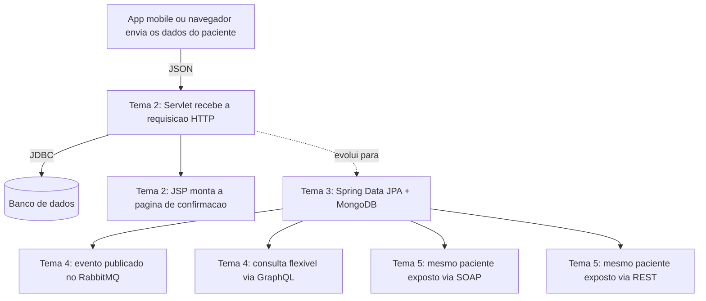

# Exercício Prático: Cadastro de Paciente numa Clínica

Esse exercício pega um único cenário (cadastrar um paciente numa clínica) e acompanha ele passando pelos cinco temas da disciplina, na ordem em que essas tecnologias apareceriam de fato num sistema real. Em vez de duplicar código, cada passo aponta pros arquivos que já existem em cada pasta de tema, mostrando como aquela peça isolada se encaixa no fluxo inteiro. Se você está começando agora em back-end Java, dá pra seguir sem saber nada de antemão, cada conceito é explicado no momento em que entra em cena.

## O cenário

Uma clínica tem um app mobile e um site onde o paciente se cadastra informando nome, idade e convênio. Depois de cadastrado, esse dado precisa ser salvo, consultado de formas diferentes, avisar outros sistemas (tipo o financeiro do convênio) e ainda ser acessível por um sistema parceiro externo. É esse caminho completo, do dado chegando até ele estar disponível em múltiplas formas, que esse exercício mostra.

## Passo 1 (Tema 1): o dado chega em formato de texto

Antes de qualquer processamento, o app mobile ou o navegador precisa mandar o dado do paciente de algum jeito que o servidor entenda. Esse é o papel dos formatos de transmissão de dados, JSON, XML ou YAML. Em [`../tema-01-formatos-dados/FormatosDados.java`](../tema-01-formatos-dados/FormatosDados.java) tem exatamente esse dado representado como JSON, o nome, a idade e o convênio do paciente, do jeito que chegaria numa requisição real antes de virar objeto Java.

## Passo 2 (Tema 2): o servidor recebe, processa e responde

Com o JSON em mãos, alguém no servidor precisa receber essa requisição HTTP, processar e devolver uma resposta. É isso que o Servlet faz em [`../tema-02-servlet-jsp-jdbc/PacienteServlet.java`](../tema-02-servlet-jsp-jdbc/PacienteServlet.java): recebe os dados do paciente e encaminha pro [`exemploJsp.jsp`](../tema-02-servlet-jsp-jdbc/exemploJsp.jsp), que monta a página de confirmação que o usuário vê no navegador.

Só que só processar não basta, o dado precisa ser salvo de verdade em algum banco. É isso que o [`ExemploJDBC.java`](../tema-02-servlet-jsp-jdbc/ExemploJDBC.java) mostra: a conexão direta com o banco via JDBC, abrindo conexão, montando a consulta e salvando ou buscando o paciente.

## Passo 3 (Tema 3): trocando JDBC manual por Spring Data

O JDBC puro do passo anterior funciona, mas exige escrever cada consulta na mão. O Tema 3 resolve isso com Spring Data: o [`Paciente.java`](../tema-03-spring-data-postgresql-mongodb/Paciente.java) e o [`PacienteRepository.java`](../tema-03-spring-data-postgresql-mongodb/PacienteRepository.java) fazem o mesmo trabalho de salvar e buscar paciente no PostgreSQL, só que sem precisar escrever SQL manualmente.

Só que nem todo dado do paciente é tão fixo assim. O histórico de atendimento varia de paciente pra paciente, um pode ter uma observação, outro pode ter várias, então esse dado vai pro MongoDB em vez do PostgreSQL, representado em [`HistoricoAtendimento.java`](../tema-03-spring-data-postgresql-mongodb/HistoricoAtendimento.java) e [`HistoricoAtendimentoRepository.java`](../tema-03-spring-data-postgresql-mongodb/HistoricoAtendimentoRepository.java). O [`PacienteController.java`](../tema-03-spring-data-postgresql-mongodb/PacienteController.java) expõe os dois bancos juntos como um único serviço REST.

## Passo 4 (Tema 4): avisando outros sistemas e permitindo consulta flexível

Assim que o paciente é cadastrado, o sistema do convênio (por exemplo) precisa ser avisado, sem que o cadastro do paciente fique esperando essa outra parte responder. É pra isso que serve mensageria: o [`ProdutorPedidoRabbitMQ.java`](../tema-04-servicos-mensageria/ProdutorPedidoRabbitMQ.java) mostra como publicar uma mensagem numa fila (nesse exercício, seria uma mensagem tipo "paciente cadastrado" em vez de "pedido confirmado"), e o sistema do convênio consome essa fila no seu próprio tempo, sem travar o cadastro.

Já quando o app mobile ou o site quer consultar dado do paciente, nem sempre precisa de tudo, às vezes só o nome, às vezes nome e convênio. O [`PedidoGraphQLController.java`](../tema-04-servicos-mensageria/PedidoGraphQLController.java) mostra como o GraphQL permite que quem consulta escolha exatamente os campos que quer, numa única requisição.

## Passo 5 (Tema 5): expondo pra sistemas de fora

Por fim, imagina que um sistema parceiro (por exemplo, o sistema de um laboratório) precisa consultar o convênio do paciente, mas ele é um sistema antigo que só integra via SOAP, com contrato formal e WSDL. É isso que [`PacienteSoapService.java`](../tema-05-web-services-soap-rest/PacienteSoapService.java) e [`PacienteSoapServiceImpl.java`](../tema-05-web-services-soap-rest/PacienteSoapServiceImpl.java) resolvem. Ao mesmo tempo, um app mobile mais moderno prefere consumir isso como REST simples, sem contrato rígido, o que o [`PacienteRestService.java`](../tema-05-web-services-soap-rest/PacienteRestService.java) já demonstra. O mesmo dado de paciente, exposto dos dois jeitos, cada um servindo um tipo de cliente diferente.

## Fechando o ciclo

Repare que os cinco temas não são blocos isolados de conteúdo, eles são camadas de um mesmo sistema. O dado entra como texto (Tema 1), é processado e persistido no servidor (Tema 2), evolui pra uma forma de persistência mais robusta e organizada (Tema 3), se comunica com outros sistemas de forma assíncrona e flexível (Tema 4), e por fim fica disponível pra qualquer sistema externo consumir, seja ele antigo ou moderno (Tema 5). É esse encadeamento que faz Java ainda ser uma escolha sólida pra sistema corporativo que precisa lidar com múltiplas plataformas ao mesmo tempo.
